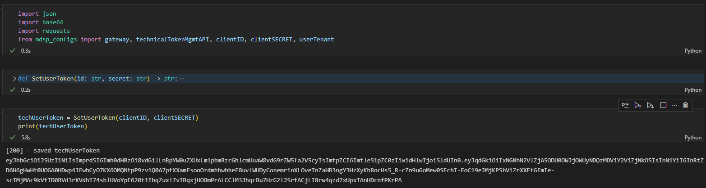

# Generate a techUserToken for further interactions with the MindSphere APIs

The `SetUserToken()` function uses your `client_id` and `client_secret` to get a *techUserToken*.

Example output:

> Info: this function was run and tested on python version 3.10.8
