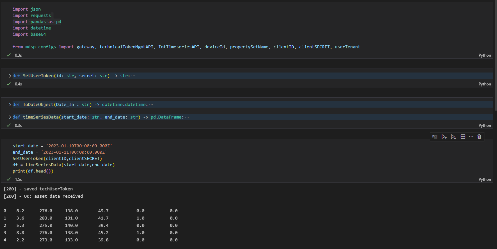

# Get and store Timeseries Data using MindSphere's Timeseries API

This function uses your [techUserToken](../Authentication/auth.py) to read Timeseries data from a specified time interval and stores them in a `pd.dataframe` for further data processing. You can find the `timeSeriesData()` function in the [timeSeriesData.py](timeSeriesData.py) file.

Function structure: 
- `timeSeriesData(start_date: str, end_date: str) -> pd.dataframe:`

Function Inputs:
- `start_date` (string in the form of *'%Y-%m-%dT%H:%M:%S.%fZ'*)
- `end_date` (string in the form of *'%Y-%m-%dT%H:%M:%S.%fZ'*)

> PLEASE NOTE: by default, the `timeSeriesData()` function is accessing the *global variable* `techUserToken`. If you don't want to use global variables, you need to pass the `techUserToken` as a third input for the `timeSeriesData()` function.

> The `timeSeriesData()` function is using the helper function *`ToDateObject()`*. This usage is optional, but converting the dataframe timestamps from `str` to `datetime.datetime` is needed for many further steps like plotting, calculation and analysis... 

Example Output:

> Info: this function was run and tested on python version 3.10.8
