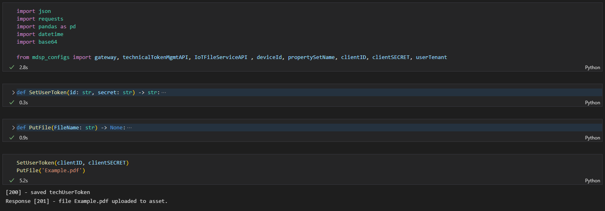

# Attach a PDF file to an Asset using MindSphere's IoT File Service API

This function uses you [techUserToken](./Authentication/auth.py) to attach a PDF file to a specified asset using the IoT File Service API. You can find the `PutFile()` function in the [PutFile.py](/PutFile.py) file.

Function structure: 
- `PutFile(FileName: str) -> None:`

Function inputs:
- `FileName` (string name of the file you want to upload, e.g. 'Example.pdf')

> PLEASE NOTE: by default, the `PutFile()` function is accessing the *global variable* `techUserToken`. If you don't want to use global variables, you need to pass the `techUserToken` as a third input for the `PutFile()` function.

> PLEASE NOTE: In this example, the file to upload is located in the same directory as the [PutFile.py](/PutFile.py) file.
> 
>
> If you want to upload a file from a different directory, you must specify the directory path when calling `datafile.open('Path_To_Directory', 'rb')`

Example Output:

> Info: this function was run and tested on python version 3.10.8
