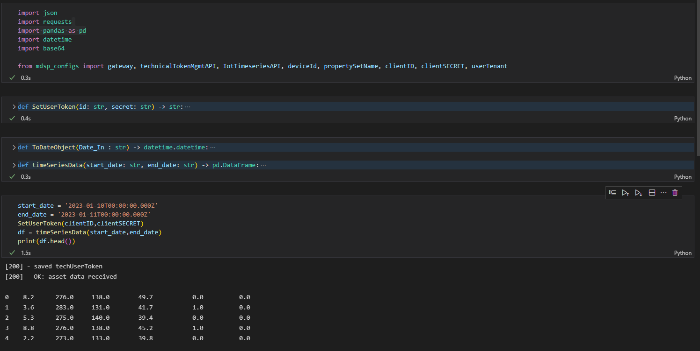

# Get and store Timeseries Data using MindSphere's TimeSeries API

This function uses your [`techUserToken`](../Authentication/auth.py) to read TimeSeries data from a specified interval and stores them in a pandas dataframe for further data processing.

Example Output:

